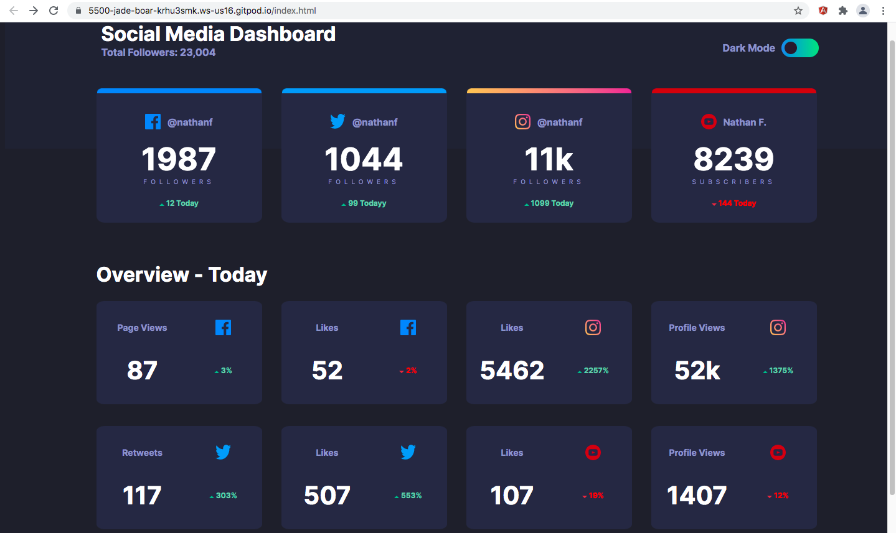
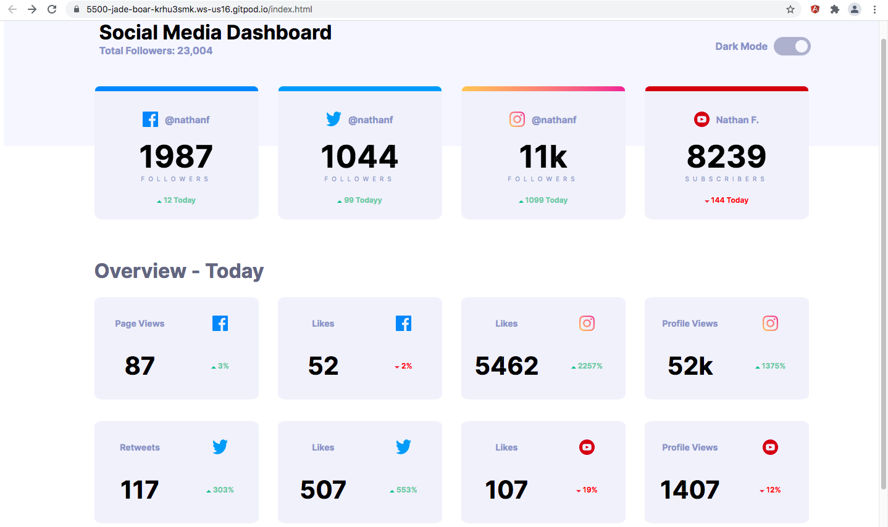

# Social media dashboard with theme switcher solution

## Overview

Users should be able to:

- View the optimal layout for the site depending on their device's screen size
- See hover states for all interactive elements on the page
- Toggle color theme to their preference

### Screenshot

**Dark Mode** 

**Light Mode** 

### Links

- Solution URL: [solution](#https://your-solution-url.com)
- Live Site URL: [Social-media-live](#https://your-live-site-url.com)

## My process

### Built with

- Semantic HTML5 markup
- CSS custom properties
- CSS Grid
- Bootstrap
- Javascript
- Mobile-first workflow

### What I learned

My work in office requires developing lot's of dashboards. So it was always in my mind to develop a fully fledeged dashboard screen with better styling. This challenge was a better boost to my knowledge on developing dashboards in a more elegant way.

One new thing I did come across while building this UI was the use of **CSSOM(CSS object model)**.

**CSSOM**: The CSS Object Model is a set of APIs allowing the manipulation of CSS from JavaScript. It is much like the DOM, but for the CSS rather than the HTML. It allows users to read and modify CSS style dynamically.

Do visit [CSSROM](https://developer.mozilla.org/en-US/docs/Web/API/CSS_Object_Model) which is a mdn documentation for a clear understanding of CSS object model.

### Continued development

Have added a feature of color change for each of the cards based on increase or decrease of followers count. Planning to refer this UI and build a single page working application for displaying information based on finance , healthcare etc.

### Useful resources

- [CSSOM](https://developer.mozilla.org/en-US/docs/Web/API/CSS_Object_Model) - This was helpful with respect to changing elements based on pseudo classes. 

## Author

- Github - [Vaishak KS](https://github.com/VaishakKS)

## Acknowledgments

A Big shoutout to [Front End Mentor](https://www.frontendmentor.io?ref=challenge) Challenges. They provide the best templates as challenge so that a aspiring developer can get an idea of how UI/UX screens are converted to code. 

